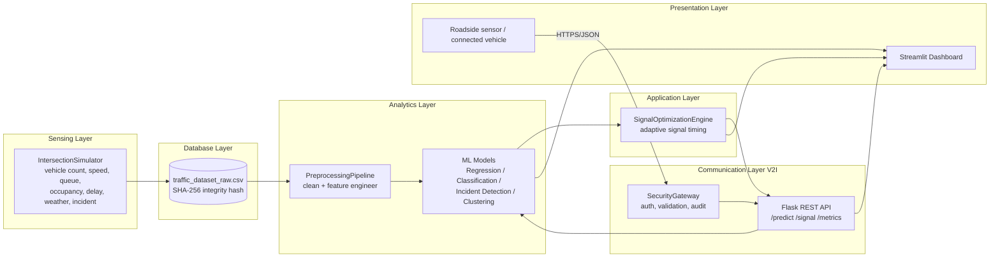

# Auckland AI-Based Adaptive Traffic Signal Optimization System

**Course:** MSE806 Intelligent Transportation Systems — Assessment 2
**Student ID:** 270770489 | **Supervisor:** Dr Mukesh Mishra
**Learning outcomes targeted:** LO3 (apply ITS technologies in a reliable
software/communication system) and LO4 (analyse and assess ITS efficiency
to support enhanced system security).

---

## 1. Project Overview

This project is an end-to-end Intelligent Transportation System (ITS)
prototype that predicts traffic congestion and automatically recommends
adaptive traffic-signal timing for four simulated Auckland intersections.
It combines:

- **Simulated sensor data** (vehicle count, speed, queue length,
  occupancy, delay, weather, incident flag) for four intersections.
- **Machine learning** for congestion prediction, queue-length
  forecasting and incident detection.
- **A rule-based optimisation engine** that converts ML predictions into
  a safe, adaptive green-light duration.
- **A REST API** simulating the V2I (Vehicle-to-Infrastructure)
  communication link between roadside sensors and the ITS backend.
- **A Streamlit dashboard** for live visualisation and demonstration.
- **A cybersecurity layer** protecting the API and dataset against
  common ITS attack patterns.

## 2. The ITS Problem

Most real-world intersections in Auckland (and most cities) still run
**fixed-time signal plans**: the same green-light duration regardless of
how much traffic is actually present. This wastes green time at quiet
intersections and starves busy ones, increasing delay, queue length and
fuel use, and is slow to react to incidents (crashes, breakdowns).

This project demonstrates how an ITS architecture — sensing →
communication → analytics → application — can close that gap by
predicting congestion in near real-time and adjusting signal timing
accordingly, while keeping the system safe (min/max green bounds) and
secure (authenticated, validated, audited communication).

## 3. System Architecture



This maps onto the classic ITS reference architecture:
**Sensing** (simulator) → **Communication** (Flask API, V2I) →
**Database** (CSV + SHA-256 integrity) → **Analytics** (ML models) →
**Application** (signal optimisation + dashboard).

## 4. Project Structure

```
its_project/
├── src/
│   ├── data/             # dataset loading helper (no hard-coded paths)
│   ├── simulation/        # sensing layer - synthetic sensor data
│   ├── preprocessing/      # cleaning + feature engineering
│   ├── models/             # regression, classification, incident, clustering
│   ├── optimization/       # adaptive signal timing engine
│   ├── security/           # auth, validation, integrity, audit, attacks
│   ├── api/                 # Flask REST API (V2I communication)
│   ├── dashboard/            # Streamlit visualisation
│   ├── evaluation/            # orchestration, comparison, figures
│   └── utils/                  # config.py, logger.py
├── tests/                        # pytest suite (45 tests)
├── outputs/                        # generated metrics, CSV, figures, models
├── docs/                              # this README, rubric mapping, summary
├── data/                                # generated dataset + integrity hash
├── main.py                                # one-command full pipeline
├── requirements.txt
└── pytest.ini
```

## 5. Setup

```bash
cd its_project
python -m venv .venv && source .venv/bin/activate   # optional but recommended
pip install -r requirements.txt
```

Requires only Python 3.10+ and the packages in `requirements.txt`.
Designed to run comfortably on a normal laptop (no GPU, no external
database, no cloud account needed).

## 6. How to Run

| Command | What it does |
|---|---|
| `python main.py` | Runs the **entire pipeline**: simulate data → hash → clean → train every model → compare fixed vs adaptive signal → run 5 simulated cyberattacks → generate figures. Produces everything in `outputs/`. |
| `pytest` | Runs the 45-test automated test suite. |
| `pytest --cov=src --cov-report=term-missing` | Runs tests with a coverage summary. |
| `python src/api/app.py` | Starts the Flask REST API on `http://127.0.0.1:5000`. |
| `streamlit run src/dashboard/app.py` | Starts the interactive dashboard. |

> Run `python main.py` **first** — it generates the dataset and trained
> model files that the API and dashboard depend on.

## 7. API Endpoints

All endpoints except `/health` require an `X-API-Key` HTTP header
(`its-auckland-demo-key-2026` for this demo).

| Method | Path | Description |
|---|---|---|
| GET | `/health` | Liveness check, no auth needed |
| POST | `/predict` | Predict congestion level (`Low`/`Medium`/`High`) from a sensor reading |
| POST | `/signal` | Predict congestion + return adaptive signal recommendation |
| GET | `/metrics` | Last trained-model metrics report |
| GET | `/security-log` | Last 50 audit log events |

Example request:

```bash
curl -X POST http://127.0.0.1:5000/signal \
  -H "Content-Type: application/json" \
  -H "X-API-Key: its-auckland-demo-key-2026" \
  -d '{"intersection_id":"INT_01","vehicle_count":80,"avg_speed":22.0,
       "queue_length":12,"occupancy_pct":55.0,"delay_seconds":18.0,
       "weather_severity":0,"hour":8,"is_peak_hour":1,"is_weekend":0,
       "timestamp":"2026-06-26T08:00:00"}'
```

## 8. Dashboard

`streamlit run src/dashboard/app.py` opens five pages:

1. **Executive Dashboard** — headline KPI and delay-reduction chart.
2. **Traffic Trends** — per-intersection time-series of volume, speed, queue.
3. **ML Model Results** — accuracy / F1 / MAE / RMSE / recall for every
   trained model, plus the recall/precision trade-off explanation.
4. **Signal Recommendations** — live fixed-time vs adaptive-time signal
   recommendation per intersection.
5. **Security & Audit** — simulated attack results and recent audit log.

## 9. Testing

`pytest` runs **45 tests** across 7 files covering: data simulation,
preprocessing/validation, ML model training & prediction, adaptive
signal logic, the security module (auth, validation, abnormal value,
spoof detection, SHA-256 integrity, audit log, 5 simulated attacks), the
Flask API, and CSV/data export. All 45 currently pass.

```
45 passed in ~60s
```

Coverage of the core logic packages (`models`, `optimization`,
`preprocessing`, `security`, `simulation`) is 85–100%; the Streamlit
dashboard and figure-plotting code are exercised manually during the
live demo rather than unit-tested, since they are thin UI/plot wrappers
around already-tested logic.

No file path in the codebase is hard-coded to a specific machine — every
path is built from `src/utils/config.py`, which resolves paths relative
to the project root.

## 10. Results Summary

(See `outputs/model_metrics.csv`, `outputs/baseline_vs_adaptive.csv` and
`outputs/figures/` for the full, regenerable results.)

**Congestion classification** (best: Gradient Boosting)
Accuracy 86.8%, F1 86.7% — both above the 85% target.

**Queue-length regression** (best: Gradient Boosting)
MAE 0.40 vehicles, RMSE 0.50, R² 0.93.

**Incident detection — the "critical fix"** (Random Forest, recall-tuned)
At the default 0.5 threshold: recall 84.2%, precision 99.2%.
After threshold tuning to 0.30: recall **93.4%**, precision 94.0%.
Lowering the threshold deliberately trades a small amount of precision
(a few more false alarms) for a large recall gain (far fewer missed
incidents) — the right trade-off for a road-safety system, where a
missed incident is far more costly than an extra false alarm.

**Fixed-time vs AI-adaptive signal** (busiest intersection, Queen St)
Queue length reduced ~23%, average delay reduced ~20%, estimated
travel-time improvement ~17%.

## 11. Security Features

| Control | Class | What it stops |
|---|---|---|
| API key authentication | `ApiKeyAuthenticator` | Unauthorised API access |
| Input schema validation | `InputValidator` (pydantic) | Malformed / out-of-range payload |
| Abnormal value detection | `AbnormalValueDetector` | Physically-impossible value combination |
| Spoof / replay detection | `SpoofedDataDetector` | Duplicate-timestamp replay attack |
| SHA-256 data integrity | `FileIntegrityChecker` | Tampered/corrupted dataset file |
| Audit logging | `AuditLogger` | Lack of traceability/accountability |
| Missing-data handling | `DataCleaner` | Sensor drop-out / partial readings |

All five required simulated attacks (fake vehicle count, impossible
speed, missing API key, duplicate timestamp, tampered hash) are
correctly blocked — see `outputs/security_test_results.csv`.

## 12. Limitations

- Traffic sensor data is **simulated**, not collected from real Auckland
  Transport hardware (real loop-detector data at this resolution is not
  publicly released). The simulator is statistically realistic but is
  not a substitute for field validation.
- The adaptive-vs-fixed comparison uses a transparent analytical
  relationship between green time and queue/delay reduction rather than
  a full microscopic traffic simulator (e.g. SUMO), which was out of
  scope for a one-semester assignment.
- The API key is a single static shared secret, sufficient to
  demonstrate access control but not production-grade (a real
  deployment would use OAuth2/mTLS and key rotation).
- No real-time streaming/V2X radio link is implemented; the REST API
  stands in for the V2I message exchange.

## 13. Future Work

- Replace the simulated dataset with real Auckland Transport SCATS data
  once access is available.
- Integrate a microscopic traffic simulator (SUMO) for a more rigorous
  baseline-vs-adaptive comparison.
- Add OAuth2/JWT authentication and TLS for production-grade security.
- Extend the emergency-override placeholder into a real V2X
  pre-emption integration with emergency-vehicle transponders.
- Add online/incremental learning so models keep adapting as new
  traffic patterns emerge, rather than retraining from a static batch.

## 14. LO3 / LO4 Mapping

See [`docs/RUBRIC_MAPPING.md`](RUBRIC_MAPPING.md) for the detailed
evidence mapping of every rubric category (report writing, ITS
technology application, software communication system, ITS efficiency
& security analysis, project implementation, presentation) to specific
files, classes and output artefacts in this repository.
